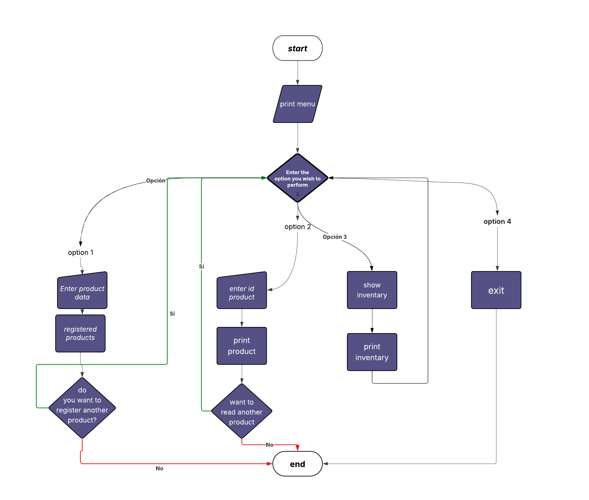

# Product Cost Calculator 🛒

A simple Python-based terminal application to calculate product costs and generate invoice summaries. The script features data validation to ensure all financial calculations are accurate.

## 🚀 Features

- **Interactive Input:** Easily enter product names, prices, and quantities.
- **Data Validation:** 
  - Prevents negative or zero values for prices.
  - Ensures quantities are positive integers.
- **Automatic Calculation:** Computes the total cost instantly.
- **Invoice Summary:** Generates a formatted visual receipt in the console.
- **Continuous Loop:** Process multiple items in a single session until you choose to exit.

## 🛠️ Requirements

- **Python 3.x** installed on your machine.

## 📋 How to Use

()

1. **Download or Clone** the script file (e.g., `main.py`).
2. **Open your terminal** or command prompt.
3. **Run the script**:
   ```bash
   inventario.py
   
